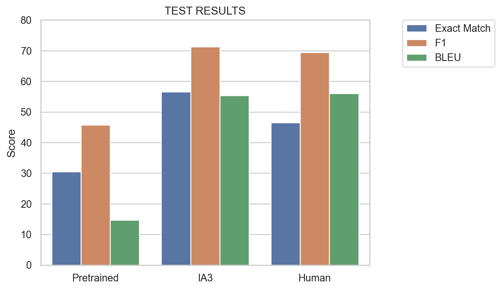
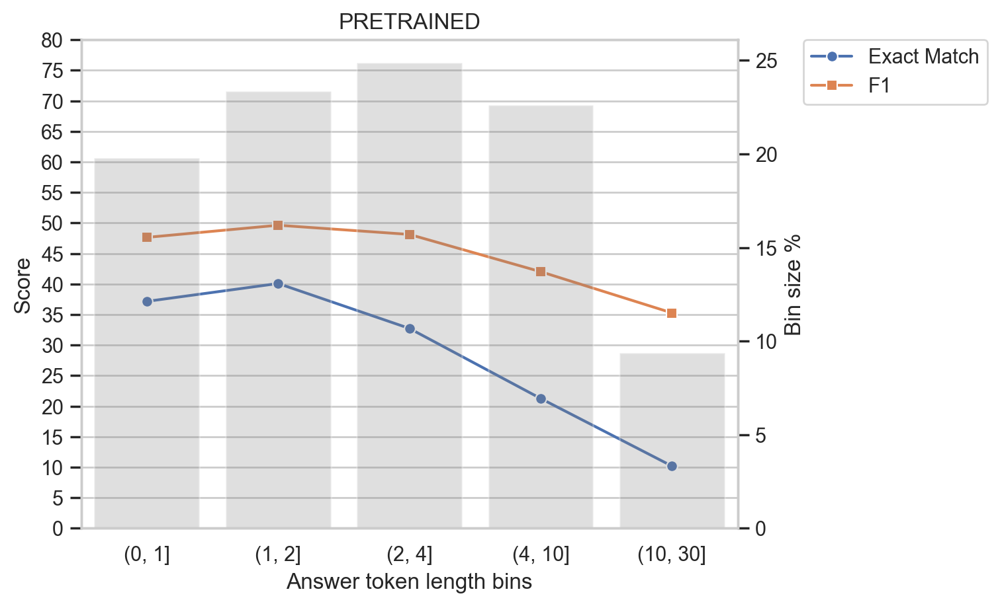
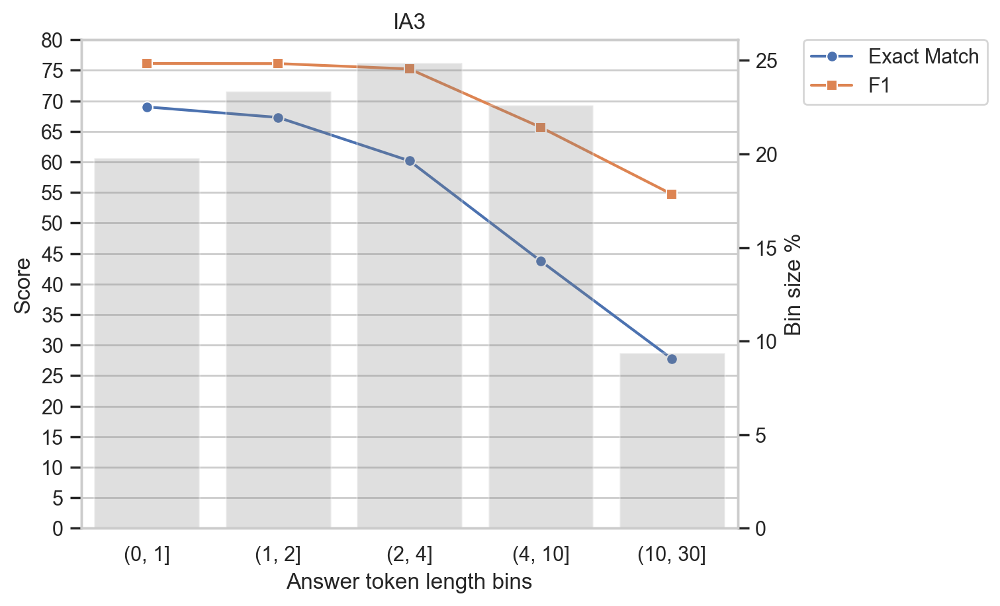
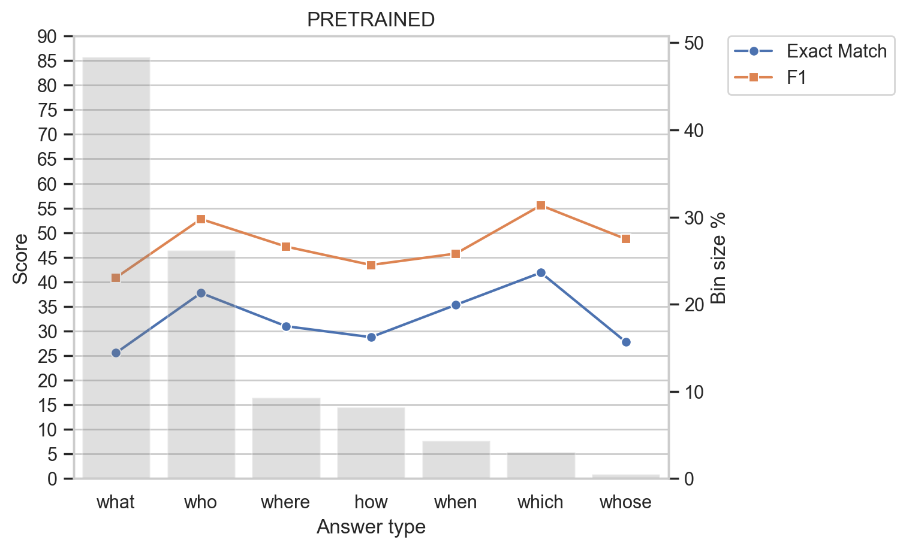
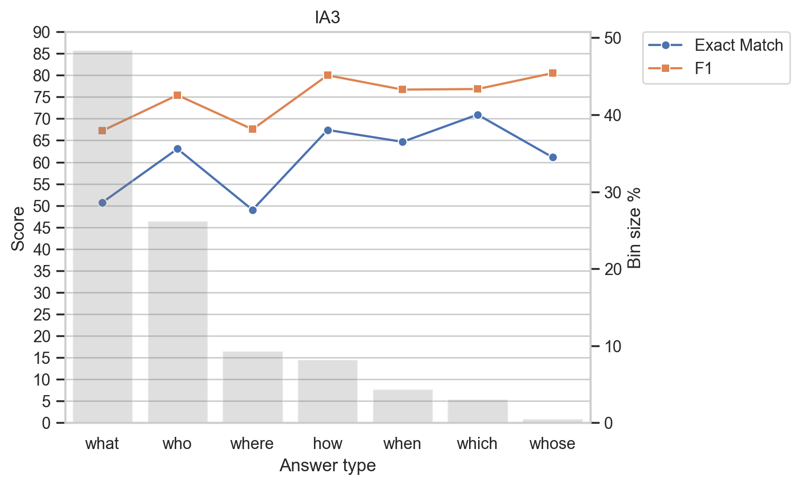

# COS80023 - NewsQA Machine Reading Comprehension
Finetune Google's Flan T5 Large model for MRC task on news article domain using NewsQA datasets.

Inference application can be accessed [here](https://huggingface.co/spaces/legacy107/flan-t5-large-ia3-newsqa).

## Results

<div align="center">
    
    <p><em>Results on NewsQA test set</em></p>
</div>

<div align="center">
    <div style="display: grid; gap: 1rem; grid-template-columns: repeat(auto-fit, minmax(350px, 1fr))">
        
        
    </div>
    <p><em>Results for different answer lengths</em></p>
</div>

<div align="center">
    <div style="display: grid; gap: 1rem; grid-template-columns: repeat(auto-fit, minmax(350px, 1fr))">
        
        
    </div>
    <p><em>Results for different question types</em></p>
</div>


## Development Setup
```bash
# Clone the repository and its submodules
git clone https://github.com/Legacy107/COS80023-NewsQA-MRC.git
cd COS80023-NewsQA-MRC
git submodule init
git submodule update

# Install dependencies
pip install -r requirements.txt

# Install pre-commit hooks
pre-commit install
pre-commit install --hook-type commit-msg
```

## Run the Gradio application
***Note***: The inference application requires around 10GB of RAM to run.
```bash
cd inference-application/flan-t5-large-ia3-newsqa
pip install -r requirements.txt
gradio app.py
```

Alternatively you can run the application using Docker:
```bash
docker run -it -p 7860:7860 --platform=linux/amd64 \
	registry.hf.space/legacy107-flan-t5-large-ia3-newsqa:latest python app.py
```
